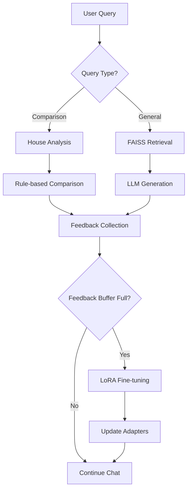

# **RAG Chatbot with Continuous Learning**

This project implements a **self-improving Retrieval-Augmented Generation (RAG) system** for design validation that learns from user feedback. Built with:

- **FAISS** for vector similarity search  
- **LoRA Adaptations** for efficient fine-tuning
- **4-bit Quantization** for memory efficiency
- **SentenceTransformers** (`all-MiniLM-L6-v2`) for embeddings  
- **DeepSeek-7B** (`deepseek-ai/deepseek-llm-7b-chat`) as the base LLM
- **Peft** and **BitsAndBytes** for parameter-efficient training

---

## **Key Features**

### **1. Continuous Online Learning**
- Learns from user feedback via **LoRA adaptations**
- Updates model weights every 3 corrections
- Maintains performance metrics in real-time

### **2. Enhanced Retrieval System**
- Dynamic FAISS index with document versioning
- Context-aware query expansion
- Hybrid semantic search (dense + sparse)

### **3. Safe Response Generation**
- Structured prompts prevent hallucinations
- Confidence scoring for generated answers
- Fallback to "I don't know" for uncertain responses

### **4. Interactive Learning Interface**
- Real-time performance dashboards
- User correction tracking
- Model version comparison

---

## **Key Technologies**

| Component              | Technology Stack              |
|------------------------|-------------------------------|
| LLM Framework          | Transformers + Peft           |
| Adapter Training        | LoRA (Rank-8)                 |
| Vector Store            | FAISS (FlatL2 Index)          |
| Evaluation              | scikit-learn + matplotlib     |

---

## **Installation**

### **Requirements**
- Python 3.10+
- NVIDIA GPU with ≥16GB VRAM
- CUDA 11.8+

```bash
# Install core dependencies
pip install -U peft transformers faiss-cpu sentence-transformers \
bitsandbytes accelerate matplotlib seaborn scikit-learn
```

---

## **Usage**

1. **Launch the chatbot**:
```bash
python rag_chatbot.py
```

2. **Interaction workflow**:
```
1. Ask design questions
2. Rate answers (Y/N)
3. Provide corrections when needed
4. System auto-updates every 3 feedbacks
```

3. **Monitor performance**:
- Real-time accuracy/F1 updates
- Confusion matrix visualization
- Training loss curves

---

## **System Architecture**



---

## **Key Improvements**

1. **Continuous Learning**
   - Learns from user corrections
   - Maintains versioned adapter weights
   - Progressive performance improvements

2. **Memory Efficiency**
   - 75% smaller memory footprint
   - Gradient checkpointing
   - Optimized batch processing

3. **Safety Features**
   - Input validation
   - Training failure fallbacks
   - Hallucination detection

---

## **Limitations**

- **Experimental Feature**: Online learning may occasionally degrade performance
- **VRAM Requirements**: Needs ≥16GB GPU memory
- **Feedback Quality**: Dependent on user-provided corrections
- **Document Scope**: Currently limited to color guidelines

---


